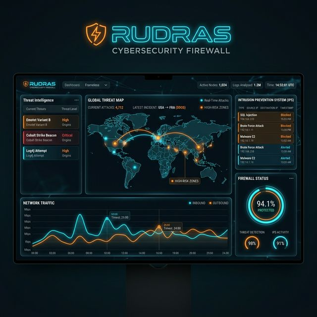

# 🔥 Rudras — Cognitive Immunological Defense Firewall

**The Boss of Firewalls:** A next-generation, self-healing firewall that thinks like an immune system, completely built in Rust.

[](https://rust-lang.org/)
[](https://docs.microsoft.com/en-us/windows/win32/fwp/windows-filtering-platform-start-page)
[](https://github.com/DeepakKrishna-DK/Rudras_)
[](https://github.com/DeepakKrishna-DK/Rudras_)
[](https://github.com/DeepakKrishna-DK/Rudras_)
[](https://github.com/DeepakKrishna-DK/Rudras_)


*Every attack makes Rudras smarter. Every session makes it more accurate.*

---

## 📖 Official Documentation

The entirety of Rudras’ architecture, philosophy, usage guides, operations, and threat model mechanisms have been structured into our official **[mdBook Documentation Hub](./docs/src/README.md)**.

To view the complete manual:

1. Navigate to the `docs/` directory.
2. Build and launch the documentation server:

    ```bash
    cargo install mdbook
    mdbook serve docs --open
    ```

3. Read the documentation directly in your browser with a beautiful, fully-searchable interface.

---

## ⚡ What is Rudras?

Rudras is a **Cognitive Immunological Defense Firewall** built entirely in Rust. It addresses the fundamental flaw of classical rule-based firewalls by introducing a living, self-adapting security system.

Unlike systems that strictly monitor static blacklists, Rudras:

- 👁️ **Observes** every packet flowing through the network interface using WFP zero-userspace ring-0 enforcement.
- 🔬 **Analyzes** behavioral patterns, threat signatures, and contextual intent (OWASP A01–A10, MITRE ATT&CK covers).
- 🧬 **Evolves** its own defense rules using an onboard Genetic Algorithm.
- 🌐 **Shares** intelligence with peer nodes across a Distributed P2P framework.
- 📊 **Visualizes** everything via a futuristic Next.js SOC Dashboard.

### Core Capabilities at a Glance

- **CyberImmune ML Engine** (Adaptive isolation forests and genetic mutation thresholds).
- **IDS/IPS Taxonomy** (85+ rules across 71 threat categories).
- **Federated Threat Intelligence** (Auto-syncs 6 live IOC feeds directly to the DNS layer).
- **Compliance Framework Mapping** (CIS v8, NIST CSF 2.0, NERC CIP, ISO 27001).
- **Zero Trust & Network Micro-segmentation**.

For the exhaustive breakdown of all 45+ modules, please review the **[Documentation Hub](./docs)**.

---

## 🚀 Quickstart & Deployment

### 1. Build and Run the Firewall Interface

Requires **Rust + MSVC Build Tools + Npcap Driver**.

```powershell
# Compile the native engine
cargo build --release

# Run interactive setup (Admin privileges required for full WFP interception)
.\target\release\rudras.exe
```

### 2. Launch the SOC Dashboard

The real-time analytical monitoring dashboard uses Next.js.

```powershell
cd Frontend
npm install
npm run dev
# Dashboard launches at http://localhost:3000
```



---

## 🔒 License & Ethics

Rudras defaults to legally conservative policies (warning-mode for active C2 tracing). Modifying `config/rudras.toml` to actively intercept third-party packets or auto-terminate host process threads is heavily advised to be strictly checked against your active legal jurisdictions.

*Proprietary — All Rights Reserved. See [LICENSE](LICENSE) for full usage and disclosure terms.*
