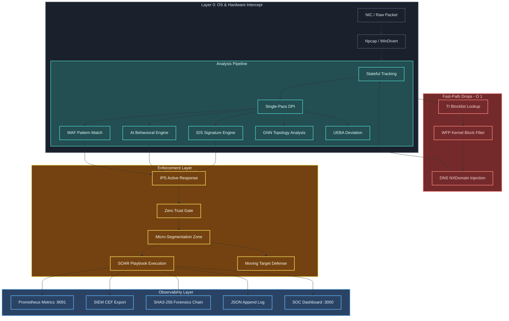

# 2.1 Hardware and Architecture for Rudras

---

## 1. Architecture Overview

Rudras v4.0 is a multi-layer, multi-threaded network security platform written in Rust. At its core, it is a packet processing pipeline that intercepts traffic at the OS kernel interface, analyzes it through 40+ overlapping detection subsystems, and enforces policy decisions.



---

## 2. Concurrency Model

Rudras is a multi-threaded application built on Tokio async runtime. The threading model is designed to maximize throughput while preventing data races through Rust's type system.

### Thread Categories

| Thread                     | Purpose                                      | Synchronization           |
| -------------------------- | -------------------------------------------- | ------------------------- |
| **Capture Thread(s)**      | Npcap packet reception                       | None (dedicated)          |
| **Packet Dispatch Thread** | Routes parsed packets to analysis subsystems | Lock-free channel         |
| **AI/EMA Update Thread**   | Computes EMA baselines every 5s              | `RwLock<HashMap>`         |
| **IDS Analysis Thread**    | Pattern matches packet content               | Shared `Arc<RuleSet>`     |
| **IPS Response Thread**    | Blocks/resets offending connections          | `Arc<AtomicBool>` gate    |
| **TI Feed Thread**         | Refreshes blocklists from files/API          | `RwLock<HashSet>`         |
| **Metrics Server Thread**  | Serves Prometheus scrapes on :9091           | `Arc<AtomicU64>` counters |
| **Process Monitor Thread** | Scans process table every 10s                | `Arc<Mutex<Config>>`      |
| **Swarm Gossip Thread**    | Sends/receives peer intelligence             | `UdpSocket`               |
| **SOAR Playbook Thread**   | Executes automated response plans            | `mpsc::channel<Alert>`    |

### Why RwLock Is Preferred Over Mutex

The `RwLock<T>` is used throughout Rudras for shared data structures that are read by many threads but written by one. Under normal operation, reads (allow/block decisions) vastly outnumber writes (learning new behavior). RwLock allows all read threads to proceed simultaneously, critical for throughput. A regular `Mutex` would serialize every read.

---

## 3. The Four Architectural Pillars (v4.0)

### Pillar A — Zero-Trust Enforcement (Layer 0 Gate)

**Module:** `Zero Trust Module`, `Identity Policy Module`, `Micro Segmentation Module`

Before any packet reaches the analysis pipeline, the Zero Trust module performs a deterministic access check evaluating:

- Device trust score (0.0–1.0)
- Identity verification (certificate/token validity)
- Session context (expected behavior deviations)
- Network zone authorization (source zone → destination zone policy)

If the check fails, the packet is dropped at the **OS kernel level** via WFP rule injection — no userspace cost.

**Zone Enforcement:** Rudras maintains 8 named security zones. Each zone has a label, allowed_ips CIDR range, and list of explicitly permitted destination zones. All other cross-zone traffic is implicitly denied:

```toml
[[zones]]
name = "db"
allowed_ips = ["[SECURE_ZONE_CIDR_REDACTED]"]
allowed_destinations = ["app"]
# db zone can only be accessed from app zone. Never from guest, corporate, internet.
```

### Pillar B — AI Behavioral Baseline Engine

**Module:** `Ai Engine Module`, `Cyber Immune Module`, `Advanced Ml Module`

The AI engine builds an **Immutable Behavioral Baseline** for each IP on first packet. The baseline captures the first observed behavioral signature as a "fingerprint". An Exponential Moving Average (EMA) tracks evolving behavior. The ratio of current EMA to the immutable baseline is the **Deviation Score**.

Key threshold parameters:

- `suspicious_threshold` ([RESTRICTED_THRESHOLD]): Flag for inspection
- `quarantine_threshold` ([RESTRICTED_THRESHOLD]): Rate-limit and alert
- `block_threshold` ([RESTRICTED_THRESHOLD]): WFP block + IPS RST inject

The EMA uses a configurable alpha (`ema_alpha`, [RESTRICTED_ALPHA]) so recent behavior is weighted heavily but historical behavior is not forgotten.

### Pillar C — Distributed Swarm Immunity

**Module:** `Distributed Immunity Module`

When any Rudras node confirms a malicious IP, it broadcasts a **gossip message** to all configured peer nodes using UDP. Peer nodes receive the message, add the IP to their local blocklist, and re-broadcast to their peers. Within milliseconds, a newly discovered malicious IP is blocked on all nodes in the swarm — even if the other nodes have never seen that IP.

Gossip message format (JSON over UDP):

```json
{
  "type": "ThreatIntel",
  "src_node": "node-01",
  "malicious_ip": "[MALICIOUS_IP_CLASSIFIED]",
  "confidence": 0.97,
  "timestamp": "2026-03-08T10:30:00+05:30"
}
```

### Pillar D — Adaptive Threat Response (Dynamic Mode Profiles)

**Module:** `Mode Profiles Module`, `Ips Engine Module`

| Threat Level | Trigger             | Automatic Response                                                                |
| ------------ | ------------------- | --------------------------------------------------------------------------------- |
| Normal       | Block rate < 5/min  | All modules active, conservative thresholds                                       |
| Elevated     | Block rate 5–50/min | Alert sensitivity increased, DPI prioritized                                      |
| Critical     | Block rate > 50/min | DPI suspended for low-priority flows, aggressive AI thresholds, anti-evasion mode |

---

## 4. Complete Module Catalog (67 Source Files)

### Category 1: Core Infrastructure

| Module            | File               | Purpose                                                                  |
| ----------------- | ------------------ | ------------------------------------------------------------------------ |
| Main Entry        | `Main Module`          | Orchestrates all module initialization, tokio runtime setup, IST logging |
| Configuration     | `Config Module`        | Deserializes `rudras.toml`, validates all fields, hot-reload support     |
| Policy Engine     | `Policy Module`        | Rule evaluation, access decision matrix                                  |
| Packet Capture    | `Capture Module`       | Npcap/PCAP packet capture loop                                           |
| Flow Tracking     | `Flow Engine Module`   | Stateful per-flow context (5-tuple), flow lifecycle management           |
| Stateful Analysis | `Stateful Module`      | TCP state machine, SYN cookie tracking                                   |
| Metrics           | `Metrics Module`       | Prometheus counters/histograms + auth server on :9091                    |
| Mode Profiles     | `Mode Profiles Module` | Threat level transitions, module sensitivity tuning                      |

### Category 2: Network Enforcement Stack

| Module           | File                  | Purpose                                                       |
| ---------------- | --------------------- | ------------------------------------------------------------- |
| WFP Engine       | `Wfp Engine Module`       | Windows Filtering Platform kernel-level block/allow rules     |
| WinDivert Engine | `Windivert Engine Module` | Userspace packet interception + modification                  |
| Npcap Forensic   | `Npcap Forensic Module`   | Promiscuous mode capture for forensic evidence recording      |
| L2 Engine        | `L2 Engine Module`        | ARP spoofing detection, 802.1Q VLAN enforcement, MAC analysis |
| DPI Engine       | `Dpi Module`              | Deep packet inspection, protocol dissection, payload analysis |

### Category 3: Detection Engines

| Module                | File                       | Purpose                                                               |
| --------------------- | -------------------------- | --------------------------------------------------------------------- |
| IDS Engine            | `Ids Engine Module`            | Signature-based detection (85 rules, 71 categories, 70+ attack types) |
| IPS Engine            | `Ips Engine Module`            | Active response: TCP RST injection, WFP blocking, quarantine          |
| Comprehensive Blocker | `Comprehensive Blocker Module` | Aggregated block decision across all detection signals                |
| Framework Alignment   | `Framework Alignment Module`   | Maps detections to MITRE ATT&CK, NIST, ISO 27001                      |

### Category 4: AI/ML Subsystem

| Module             | File                    | Purpose                                                            |
| ------------------ | ----------------------- | ------------------------------------------------------------------ |
| AI Engine          | `Ai Engine Module`          | EMA-based behavioral baseline, immutable anchor                    |
| CyberImmune        | `Cyber Immune Module`       | Biological immune metaphor, antibody propagation                   |
| Advanced ML        | `Advanced Ml Module`        | Multi-model ensemble: isolation forest, autoencoder, hybrid        |
| Advanced Security  | `Advanced Security Module`  | Multi-factor behavioral analysis, threat correlation               |
| Federated Learning | `Federated Learning Module` | Privacy-preserving model aggregation across swarm nodes            |
| GNN Engine         | `Gnn Engine Module`         | Graph Neural Network for topology-aware lateral movement detection |
| ETA Engine         | `Eta Engine Module`         | Encrypted Traffic Analysis without decryption via TLS metadata     |
| Network DPI ML     | `Network Dpi Ml Module`     | ML-assisted protocol classification on raw DPI output              |
| RL Policy          | `Rl Policy Module`          | Reinforcement Learning for dynamic threshold optimization          |

### Category 5: Threat Intelligence

| Module              | File                     | Purpose                                                                 |
| ------------------- | ------------------------ | ----------------------------------------------------------------------- |
| Threat Intelligence | `Threat Intelligence Module` | IOC feed management: 24,358 IPs, 1.25M domains, 84,501 malware sigs     |
| DNS Security        | `Dns Security Module`        | DNS-layer blocking: C2 domains, DGA detection, DNS tunneling            |
| Threat Hunt         | `Threat Hunt Module`         | Proactive hypothesis-driven threat hunting across flow data             |
| Threat Rules Engine | `Threat Rules Engine Module` | Composite rule evaluation combining TI + behavioral + signature signals |

### Category 6: Enterprise Security

| Module               | File                      | Purpose                                                                  |
| -------------------- | ------------------------- | ------------------------------------------------------------------------ |
| Zero Trust           | `Zero Trust Module`           | Device trust scoring, continuous verification, zone enforcement          |
| Identity Policy      | `Identity Policy Module`      | Identity-aware policy with certificate/token validation                  |
| Micro-Segmentation   | `Micro Segmentation Module`   | 8-zone network segmentation with explicit allow policy                   |
| Endpoint Security    | `Endpoint Security Module`    | Host-based posture assessment, patch age, vulnerability scanning         |
| Attribution Scoring  | `Attribution Scoring Module`  | TTP/technique-based attacker attribution scoring                         |
| SIEM Integration     | `Siem Integration Module`     | CEF log format, Syslog export, Splunk/Elastic webhook                    |
| Distributed Immunity | `Distributed Immunity Module` | Swarm gossip protocol for peer intelligence sharing                      |
| Gateway Mode         | `Gateway Mode Module`         | Edge gateway configuration and BGP-aware policy                          |
| SD-WAN               | `Sdwan Module`                | SD-WAN traffic prioritization and QoS integration                        |
| Cloud Native         | `Cloud Native Module`         | Kubernetes API server protection, container escape detection, cloud IMDS |
| Single Pass          | `Single Pass Module`          | Unified L2–L7 inspection in one packet traversal                         |

### Category 7: Research-Grade Modules (v4.0)

| Module                | File                       | Purpose                                                      |
| --------------------- | -------------------------- | ------------------------------------------------------------ |
| UEBA Engine           | `Ueba Engine Module`           | User and Entity Behavior Analytics, insider threat detection |
| SOAR Engine           | `Soar Engine Module`           | Security Orchestration, Automation and Response playbooks    |
| Deception             | `Deception Module`             | Honeypot/canary token infrastructure                         |
| Adaptive Honeypot     | `Adaptive Honeypot Module`     | Dynamic honeypot that mimics real services                   |
| OT Protocols          | `Ot Protocols Module`          | Modbus/DNP3/EtherNet-IP ICS protocol security                |
| Post-Quantum          | `Post Quantum Module`          | NIST FIPS 203/204/205 (ML-KEM, ML-DSA, SLH-DSA)              |
| Formal Verification   | `Formal Verification Module`   | TLA+-based policy consistency verification                   |
| TPM Attestation       | `Tpm Attestation Module`       | Hardware root-of-trust, PCR measurement verification         |
| MTD Engine            | `Mtd Engine Module`            | Moving Target Defense — IP rotation, port shuffling          |
| Homomorphic Sharing   | `Homomorphic Sharing Module`   | Encrypted threat intel sharing without plaintext exposure    |
| Email Security        | `Email Security Module`        | SMTP/DKIM/SPF/DMARC verification, phishing detection         |
| RASP Engine           | `Rasp Engine Module`           | Runtime Application Self-Protection hooks                    |
| Secure Channel        | `Secure Channel Module`        | mTLS channel management, certificate lifecycle               |
| SBOM Engine           | `Sbom Engine Module`           | Software Bill of Materials validation                        |
| Supply Chain Verifier | `Supply Chain Verifier Module` | Cryptographic package signing verification                   |
| eBPF/XDP (Roadmap)    | `Ebpf Xdp Module`              | Linux eBPF/XDP kernel bypass (in-development)                |
| P4 Offload (Roadmap)  | `P4 Offload Module`            | Programmable switch P4 dataplane offload (in-development)    |
| Compliance Engine     | `Compliance Engine Module`     | GDPR/HIPAA/PCI-DSS automated compliance reporting            |
| QUIC Inspector        | `Quic Inspector Module`        | QUIC/HTTP3 deep inspection                                   |
| Forensics Chain       | `Forensics Chain Module`       | SHA3-256 immutable audit log chain                           |
| Differential Privacy  | `Differential Privacy Module`  | Privacy-preserving telemetry aggregation                     |
| Management API        | `Management Api Module`        | REST API for configuration, status, incident management      |
| LLM Explainability    | `Llm Explainability Module`    | LLM-generated natural language threat explanations           |
| Policy Verifier       | `Policy Verifier Module`       | Automated policy conflict detection and resolution           |

### Category 8: Security Support

| Module                | File                  | Purpose                                            |
| --------------------- | --------------------- | -------------------------------------------------- |
| Process Monitor       | `Process Monitor Module`  | Windows process table scanning for tampering tools |
| Memory Safe Pool      | `Memory Safe Pool Module` | Pre-allocated packet buffers, zero GC overhead     |
| Hardware Acceleration | `Hardware Accel Module`   | CPU feature detection, SIMD-accelerated hashing    |

---

## 5. Data Flow: Packet Lifecycle

```
1. CAPTURE: NIC receives raw Ethernet frame
   └─ Npcap/pcap binds at data-link layer
   └─ Packet copied to userspace buffer (zero-copy where possible)

2. L2 SECURITY: l2_engine parses Ethernet header
   └─ ARP spoofing check (gratuitous ARP vs. known MAC table)
   └─ 802.1Q VLAN tag enforcement

3. FAST-PATH DROPS (sub-microsecond):
   └─ IP checked against TI blocklist (RwLock<HashSet<IpAddr>>)
   └─ WFP kernel filter pre-checks matching IP/port rules
   └─ If blocked: drop packet, increment metric, log to SIEM. STOP.

4. STATEFUL FLOW TRACKING:
   └─ flow_engine creates or updates FlowRecord keyed by 5-tuple
   └─ Stateful Module maintains TCP state machine (SYN/SYN-ACK/ACK/FIN/RST)
   └─ SYN flood detection: count half-open connections, rate-limit at threshold

5. SINGLE-PASS INSPECTION (Dpi Module + Single Pass Module):
   └─ Protocol identification: TCP/UDP/ICMP/QUIC/DNS/HTTP/TLS
   └─ WAF patterns: SQL injection, XSS, RCE, path traversal, SSRF
   └─ DLP patterns: credit card, API key, PII detection in outbound payloads

6. AI BEHAVIORAL ANALYSIS:
   └─ ai_engine: update EMA for src IP, compute deviation score
   └─ cyber_immune: compare against immutable anchor
   └─ advanced_ml: multi-model ensemble scoring (if enabled)
   └─ ueba_engine: user pattern deviation (if identity known)

7. IDS SIGNATURE MATCHING:
   └─ ids_engine: match packet against 85 rules across 71 categories
   └─ Generates alert events with severity, category, MITRE technique
   └─ Feeds alert into SOAR playbook queue

8. COMPREHENSIVE BLOCK DECISION:
   └─ comprehensive_blocker aggregates all signals: TI + IDS + AI + DNS
   └─ Weighted scoring produces final action: ALLOW / ALERT / QUARANTINE / BLOCK

9. IPS ENFORCEMENT (if BLOCK/QUARANTINE):
   └─ ips_engine injects TCP RST to both ends of connection
   └─ WFP rule registered to block subsequent packets from src IP
   └─ Swarm gossip broadcast to peers
   └─ SOAR playbook triggered (if severity >= HIGH)

10. OBSERVABILITY:
    └─ metrics: increment relevant counters (packets_total, blocks_total, alerts_total)
    └─ siem_integration: emit CEF event to syslog endpoint
    └─ forensics_chain: append event to SHA3-256 chained audit log
    └─ tracing: emit structured JSON log with IST timestamp
```

---

## 6. Configuration Architecture

The primary configuration file is `config/rudras.toml`. It is divided into sections mapping directly to module configurations:

```toml
[ai]          # Ai Engine Module, Advanced Ml Module, Cyber Immune Module parameters
[ids]         # Ids Engine Module rule categories, signatures
[ips]         # Ips Engine Module response thresholds
[threat_intel]# Threat Intelligence Module feed paths, refresh intervals
[dns]         # Dns Security Module blocklist paths, DGA detection
[zero_trust]  # Zero Trust Module trust score thresholds, posture requirements
[[zones]]     # Micro Segmentation Module zone definitions
[metrics]     # Metrics Module port, auth token validity duration
[logging]     # log path, rotation policy, IST timezone display
[capture]     # Capture Module interface, promiscuous mode, buffer sizes
[swarm]       # Distributed Immunity Module peer node addresses
[soar]        # Soar Engine Module playbook definitions
[compliance]  # Compliance Engine Module regulated framework targets
```

All configuration is hot-reloadable. The `Config Module` module fires a reload event that each subscribed module receives via a tokio watch channel.
